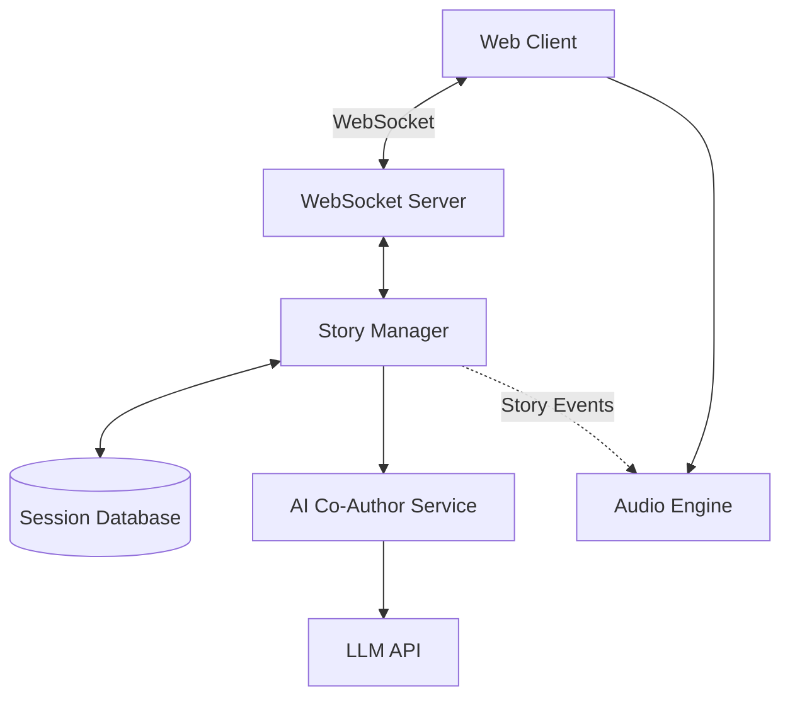

# Design Document

## Overview

The Ghost Story Generator is a real-time collaborative web application built with modern web technologies. The system consists of three primary subsystems: a collaborative story management layer, an AI co-authoring service, and a dynamic audio generation engine. The application uses WebSocket connections for real-time synchronization, integrates with an LLM API for AI-generated content, and employs the Web Audio API for sophisticated sound generation and mixing.

The architecture prioritizes real-time responsiveness, scalability for multiple concurrent sessions, and seamless integration between narrative content and atmospheric audio. The system maintains narrative coherence through context-aware AI generation while providing an immersive audio experience that dynamically responds to story content.

## Architecture

### System Components



### Technology Stack

- **Frontend**: React with TypeScript, Web Audio API, WebSocket client
- **Backend**: Node.js with Express, Socket.io for WebSocket management
- **AI Integration**: OpenAI API or similar LLM service
- **Database**: Redis for session state, PostgreSQL for persistent storage
- **Audio**: Web Audio API with Tone.js for advanced synthesis

### Communication Flow

1. Users connect via WebSocket to join or create story sessions
2. Story contributions flow through the WebSocket server to the Story Manager
3. The Story Manager broadcasts updates to all session participants
4. The AI Co-Author monitors narrative length and triggers horror element generation
5. The Audio Engine receives story events and adjusts soundscapes in real-time
6. All session state persists to the database for recovery and export

## Components and Interfaces

### Story Manager

**Responsibilities:**
- Create and manage story sessions
- Maintain narrative context and story segments
- Coordinate between users, AI, and audio systems
- Handle session persistence and recovery

**Key Interfaces:**

```typescript
interface StorySession {
  id: string;
  title: string;
  startingPrompt?: string;
  participants: Participant[];
  segments: StorySegment[];
  createdAt: Date;
  lastActivityAt: Date;
}

interface StorySegment {
  id: string;
  content: string;
  contributorId: string;
  contributorType: 'user' | 'ai';
  timestamp: Date;
  moodTags: string[];
}

interface Participant {
  id: string;
  name: string;
  joinedAt: Date;
}

class StoryManager {
  createSession(title: string, startingPrompt?: string): StorySession;
  addParticipant(sessionId: string, participant: Participant): void;
  addSegment(sessionId: string, segment: StorySegment): void;
  getSession(sessionId: string): StorySession;
  exportSession(sessionId: string, format: 'text' | 'html'): string;
}
```

### AI Co-Author Service

**Responsibilities:**
- Monitor narrative context for trigger conditions
- Generate coherent horror elements based on story context
- Maintain character and setting consistency
- Filter inappropriate content

**Key Interfaces:**

```typescript
interface NarrativeContext {
  segments: StorySegment[];
  characters: string[];
  locations: string[];
  timeperiod?: string;
  genre?: string;
}

interface HorrorElement {
  content: string;
  intensity: number;
  tags: string[];
}

class AICoAuthor {
  shouldTrigger(context: NarrativeContext): boolean;
  generateHorrorElement(context: NarrativeContext): Promise<HorrorElement>;
  extractEntities(text: string): { characters: string[]; locations: string[] };
  filterContent(text: string): string;
}
```

### Audio Engine

**Responsibilities:**
- Analyze story content for mood and keywords
- Generate and mix atmospheric soundscapes
- Trigger event-based sound effects
- Manage audio playback and user controls

**Key Interfaces:**

```typescript
interface AudioSettings {
  masterVolume: number;
  ambientVolume: number;
  effectsVolume: number;
  muted: boolean;
}

interface SoundLayer {
  type: 'ambient' | 'effect';
  source: AudioBufferSourceNode | OscillatorNode;
  gain: GainNode;
  intensity: number;
}

class AudioEngine {
  initialize(audioContext: AudioContext): void;
  analyzeMood(text: string): string[];
  updateSoundscape(moodTags: string[]): void;
  triggerEffect(keyword: string): void;
  setVolume(settings: AudioSettings): void;
  mute(): void;
  unmute(): void;
}
```

### WebSocket Server

**Responsibilities:**
- Manage real-time client connections
- Broadcast story updates to session participants
- Handle connection recovery and state synchronization

**Key Events:**

```typescript
// Client -> Server
interface ClientEvents {
  'session:create': (data: { title: string; startingPrompt?: string }) => void;
  'session:join': (sessionId: string) => void;
  'segment:add': (data: { sessionId: string; content: string }) => void;
  'session:export': (sessionId: string) => void;
}

// Server -> Client
interface ServerEvents {
  'session:created': (session: StorySession) => void;
  'session:updated': (session: StorySession) => void;
  'segment:added': (segment: StorySegment) => void;
  'participant:joined': (participant: Participant) => void;
  'error': (error: { message: string; code: string }) => void;
}
```

## Data Models

### Database Schema

**Sessions Table:**
```sql
CREATE TABLE sessions (
  id UUID PRIMARY KEY,
  title VARCHAR(255) NOT NULL,
  starting_prompt TEXT,
  created_at TIMESTAMP NOT NULL,
  last_activity_at TIMESTAMP NOT NULL,
  status VARCHAR(50) DEFAULT 'active'
);
```

**Segments Table:**
```sql
CREATE TABLE segments (
  id UUID PRIMARY KEY,
  session_id UUID REFERENCES sessions(id),
  content TEXT NOT NULL,
  contributor_id VARCHAR(255) NOT NULL,
  contributor_type VARCHAR(10) NOT NULL,
  timestamp TIMESTAMP NOT NULL,
  mood_tags TEXT[],
  INDEX idx_session_timestamp (session_id, timestamp)
);
```

**Participants Table:**
```sql
CREATE TABLE participants (
  id UUID PRIMARY KEY,
  session_id UUID REFERENCES sessions(id),
  name VARCHAR(255) NOT NULL,
  joined_at TIMESTAMP NOT NULL,
  INDEX idx_session (session_id)
);
```

### Redis Session State

```typescript
interface SessionState {
  sessionId: string;
  activeParticipants: Set<string>;
  lastAITrigger: number; // segment count
  currentMood: string[];
  audioState: {
    activeLayers: string[];
    intensity: number;
  };
}
```

## Correctness Properties

*A property is a characteristic or behavior that should hold true across all valid executions of a system—essentially, a formal statement about what the system should do. Properties serve as the bridge between human-readable specifications and machine-verifiable correctness guarantees.*


### Session Management Properties

Property 1: Session creation produces unique identifiers
*For any* two session creation requests, the generated session IDs should be unique and the sessions should be independently accessible.
**Validates: Requirements 1.1**

Property 2: New sessions initialize with empty narrative
*For any* newly created session, the narrative context should contain zero segments initially.
**Validates: Requirements 1.2**

Property 3: Session data round-trip preservation
*For any* session title, starting prompt, and audio settings, creating a session with these values and then retrieving it should return the same values.
**Validates: Requirements 1.3, 5.5**

Property 4: Session creation activates audio
*For any* newly created session, the audio engine should have at least one active ambient sound layer.
**Validates: Requirements 1.4**

### Story Contribution Properties

Property 5: Segment addition grows narrative
*For any* session and valid story segment, adding the segment should increase the narrative context length by exactly one.
**Validates: Requirements 2.1**

Property 6: Broadcast reaches all participants
*For any* session with multiple participants, when a segment is added, all participants should receive the update event.
**Validates: Requirements 2.2**

Property 7: Profanity filtering rejects inappropriate content
*For any* string containing profanity or inappropriate keywords, attempting to add it as a segment should either filter the content or reject the submission entirely.
**Validates: Requirements 2.3**

Property 8: Successful submission clears input
*For any* UI state where a valid segment is submitted, the input field should be empty after submission completes.
**Validates: Requirements 2.4**

Property 9: Chronological ordering invariant
*For any* sequence of segments added to a session, displaying the narrative should maintain the chronological order based on timestamps.
**Validates: Requirements 6.5, 7.5**

### AI Co-Author Properties

Property 10: AI triggers at threshold
*For any* session where the narrative context reaches the predetermined segment count threshold, the AI Co-Author should generate a horror element.
**Validates: Requirements 3.1**

Property 11: AI maintains context coherence
*For any* narrative context containing character names, locations, or events, the AI-generated horror element should reference at least one entity from the context.
**Validates: Requirements 3.2, 8.1, 8.2, 8.4**

Property 12: AI segments are marked distinctly
*For any* AI-generated horror element, the resulting story segment should have contributorType set to 'ai' and should render with distinct visual styling.
**Validates: Requirements 3.3, 3.4, 7.2, 7.3**

Property 13: AI generation diversity
*For any* sequence of multiple AI-generated horror elements in the same session, the elements should not be identical in content.
**Validates: Requirements 12.1**

Property 14: AI content filtering
*For any* AI-generated horror element, the content should not contain graphic violence keywords or explicit content patterns.
**Validates: Requirements 12.2**

### Audio Engine Properties

Property 15: Audio analyzes all content changes
*For any* segment added to the narrative, the audio engine should perform mood analysis on the segment content.
**Validates: Requirements 2.5, 4.1**

Property 16: Keywords trigger sound effects
*For any* segment containing horror keywords (scream, thunder, creak, etc.), the audio engine should trigger at least one corresponding sound effect.
**Validates: Requirements 4.2, 9.1**

Property 17: Mood shifts change soundscape
*For any* two consecutive segments with different mood tags, the audio engine's active soundscape should change between them.
**Validates: Requirements 4.3**

Property 18: Audio levels stay within bounds
*For any* combination of active sound layers, the master gain level should remain between 0.0 and 1.0 to prevent clipping.
**Validates: Requirements 4.4**

Property 19: Audio intensity progression
*For any* session, the audio intensity at the start should be lower than the intensity after adding segments with horror keywords.
**Validates: Requirements 4.5**

Property 20: Volume control immediate effect
*For any* volume adjustment, the audio engine's gain nodes should reflect the new volume value immediately.
**Validates: Requirements 5.1**

Property 21: Mute preserves state
*For any* audio state, muting should stop playback while maintaining the internal audio state, and unmuting should resume with that state.
**Validates: Requirements 5.2, 5.3**

Property 22: Location keywords affect soundscape
*For any* segment containing location keywords (forest, basement, ocean, etc.), the audio engine should adjust the active soundscape to match the location.
**Validates: Requirements 9.4**

### Collaboration Properties

Property 23: Invite links are unique and valid
*For any* session, generating an invite link should produce a unique, valid URL that includes the session identifier.
**Validates: Requirements 6.1**

Property 24: Invite links add participants
*For any* valid invite link, when accessed by a new user, that user should be added to the session's participant list.
**Validates: Requirements 6.2**

Property 25: New participants receive full context
*For any* participant joining a session with existing segments, they should receive all segments in chronological order.
**Validates: Requirements 6.3**

Property 26: Join notifications broadcast
*For any* session with existing participants, when a new participant joins, all existing participants should receive a notification event.
**Validates: Requirements 6.4**

Property 27: Segments display contributor information
*For any* rendered story segment, the display should include the contributor's name or identifier.
**Validates: Requirements 7.1**

### Export Properties

Property 28: Export includes all segments
*For any* session with N segments, exporting the story should produce output containing all N segments.
**Validates: Requirements 10.1**

Property 29: Export includes metadata
*For any* exported story, the output should contain contributor attributions for each segment, the story title, and the session creation timestamp.
**Validates: Requirements 10.2, 10.5**

Property 30: Export format support
*For any* session, requesting export in 'text' format should produce plain text, and requesting 'html' format should produce valid HTML.
**Validates: Requirements 10.4**

### Resilience Properties

Property 31: Offline queue and sync
*For any* session where network connectivity is lost, segments added during the outage should be queued and synchronized when connectivity is restored.
**Validates: Requirements 11.3**

Property 32: Session state recovery
*For any* active session, refreshing the page should restore the session state with all existing segments and participant information.
**Validates: Requirements 11.5**

## Error Handling

### Client-Side Error Handling

**Network Errors:**
- WebSocket disconnections trigger automatic reconnection with exponential backoff
- Failed segment submissions are queued locally and retried upon reconnection
- Users receive visual feedback when operating in offline mode

**Audio Errors:**
- Audio context initialization failures fall back to silent mode with visual-only experience
- Individual sound loading failures are logged but don't crash the audio engine
- Browser audio permission denials are handled gracefully with user prompts

**Validation Errors:**
- Empty or whitespace-only segments are rejected with user-friendly messages
- Profanity filter violations show sanitized error messages
- Invalid session IDs redirect users to the home page

### Server-Side Error Handling

**AI Service Errors:**
- LLM API failures trigger retry logic with exponential backoff (max 3 attempts)
- If AI generation fails completely, the session continues without AI contributions
- Rate limiting errors are handled by queuing AI generation requests

**Database Errors:**
- Connection failures trigger automatic reconnection
- Write failures are retried with exponential backoff
- Read failures return cached data when available

**Session Errors:**
- Invalid session access attempts return 404 errors
- Concurrent modification conflicts are resolved using last-write-wins strategy
- Session capacity limits (max participants) are enforced with clear error messages

### Error Logging and Monitoring

- All errors are logged with context (session ID, user ID, timestamp)
- Critical errors trigger alerts for system administrators
- Client-side errors are reported to a centralized logging service

## Testing Strategy

### Unit Testing

The application will use **Jest** as the primary testing framework for unit tests. Unit tests will focus on:

- **Story Manager**: Session creation, segment addition, participant management, export functionality
- **AI Co-Author**: Entity extraction, content filtering, trigger logic
- **Audio Engine**: Mood analysis, keyword detection, volume control, soundscape transitions
- **WebSocket Server**: Event handling, broadcast logic, connection management
- **Data Models**: Validation logic, serialization/deserialization

Example unit tests:
- Verify that creating a session with a title stores that title correctly
- Test that profanity filter correctly identifies and filters inappropriate words
- Verify that mood analysis extracts expected tags from sample text
- Test that export functions produce correctly formatted output

### Property-Based Testing

The application will use **fast-check** (JavaScript/TypeScript property-based testing library) for property-based tests. Each property-based test will:

- Run a minimum of 100 iterations with randomly generated inputs
- Be tagged with a comment explicitly referencing the correctness property from this design document
- Use the format: `// Feature: ghost-story-generator, Property N: [property text]`

Property-based tests will verify:
- Session ID uniqueness across many random session creations
- Narrative ordering invariants with random segment additions
- Audio level bounds with random layer combinations
- Round-trip properties for data persistence
- AI coherence with randomly generated narrative contexts

Example property-based test structure:
```typescript
// Feature: ghost-story-generator, Property 1: Session creation produces unique identifiers
test('session IDs are always unique', () => {
  fc.assert(
    fc.property(
      fc.array(fc.record({ title: fc.string(), prompt: fc.option(fc.string()) }), { minLength: 2, maxLength: 100 }),
      (sessionRequests) => {
        const ids = sessionRequests.map(req => storyManager.createSession(req.title, req.prompt).id);
        const uniqueIds = new Set(ids);
        return ids.length === uniqueIds.size;
      }
    ),
    { numRuns: 100 }
  );
});
```

### Integration Testing

Integration tests will verify:
- End-to-end WebSocket communication between clients and server
- AI service integration with mock LLM responses
- Database persistence and retrieval workflows
- Audio engine integration with Web Audio API

### UI Testing

UI tests using **Playwright** or **Cypress** will verify:
- User flows for creating and joining sessions
- Real-time updates appearing in the UI
- Audio controls functionality
- Export feature workflow
- Responsive layout behavior

## Performance Considerations

### Scalability

- **Session Isolation**: Each session operates independently to prevent cross-session interference
- **Redis Caching**: Active session state cached in Redis for fast access
- **Database Indexing**: Indexes on session_id and timestamp for efficient queries
- **WebSocket Scaling**: Socket.io with Redis adapter for horizontal scaling across multiple server instances

### Audio Performance

- **Lazy Loading**: Sound assets loaded on-demand rather than at startup
- **Audio Context Pooling**: Reuse audio nodes where possible to reduce memory usage
- **Throttling**: Mood analysis throttled to prevent excessive processing on rapid segment additions
- **Web Workers**: Consider offloading audio analysis to web workers for better UI responsiveness

### AI Generation Performance

- **Async Processing**: AI generation runs asynchronously to avoid blocking story contributions
- **Context Truncation**: Limit narrative context sent to LLM to most recent N segments (e.g., last 20)
- **Caching**: Cache entity extraction results to avoid reprocessing unchanged segments
- **Rate Limiting**: Implement rate limiting to prevent excessive API costs

## Security Considerations

### Input Validation

- All user inputs sanitized to prevent XSS attacks
- Content length limits enforced (max segment length: 500 characters)
- Profanity filter prevents inappropriate content
- Session ID validation prevents unauthorized access

### Authentication and Authorization

- Session-based authentication for participants
- Invite links use cryptographically secure random tokens
- Rate limiting on session creation to prevent abuse
- CORS policies restrict API access to authorized domains

### Data Privacy

- Session data encrypted at rest in database
- WebSocket connections use WSS (WebSocket Secure)
- User data retention policies (sessions deleted after 30 days of inactivity)
- No personally identifiable information stored without consent

## Deployment Architecture

### Infrastructure

- **Frontend**: Static hosting on CDN (Vercel, Netlify, or CloudFront)
- **Backend**: Node.js servers on containerized infrastructure (Docker + Kubernetes)
- **Database**: Managed PostgreSQL (AWS RDS, Google Cloud SQL)
- **Cache**: Managed Redis (AWS ElastiCache, Redis Cloud)
- **WebSocket**: Load balanced with sticky sessions or Redis adapter

### Monitoring and Observability

- Application performance monitoring (APM) with DataDog or New Relic
- Error tracking with Sentry
- WebSocket connection metrics and session analytics
- AI generation success rates and latency tracking
- Audio engine performance metrics

### CI/CD Pipeline

- Automated testing on pull requests
- Staging environment for pre-production testing
- Blue-green deployment for zero-downtime releases
- Automated rollback on deployment failures
